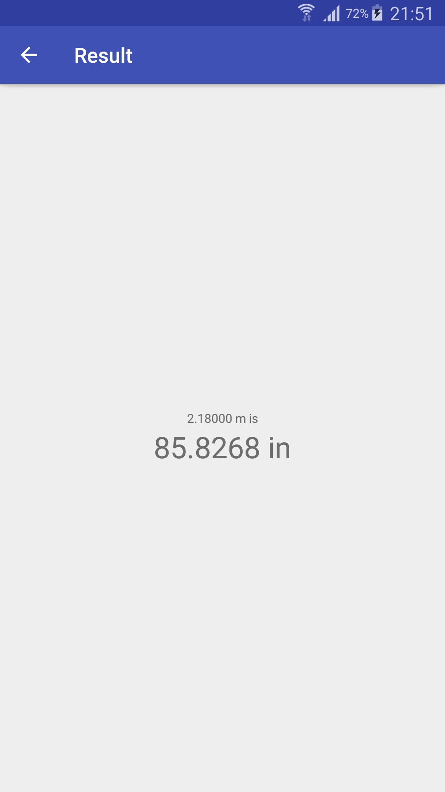
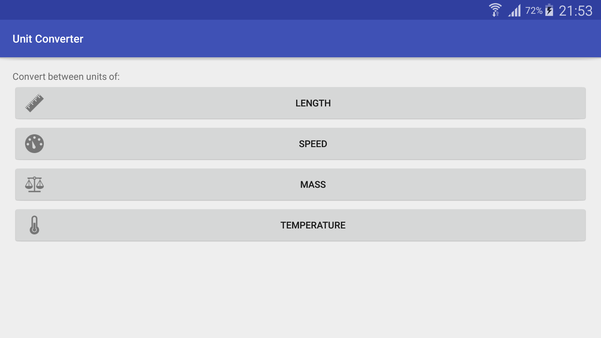

# Homework: Unit Converter

### The assignment and problems encountered

The task of this assignment was to develop an Android application which performs basic unit conversion. The first Activity in the application is the main one and it should contain buttons with images leading to appropriate conversion Activities. These Activities should contain an input field so that the user can provide the physical quantity and two spinners - one for the initial measurement unit and one for the desired unit. The conversion result should be shown in a separate, dedicated Activity.

### Utilised snippets/solutions/libraries/SO answers

* http://fontice.com/ [icons for greeter activity buttons]
* https://material.io/guidelines/layout/metrics-keylines.html [Material Design metrics, used to determine what padding should be used throughout the application]
* https://jeroenmols.com/blog/2016/03/07/resourcenaming/ [hints on naming string resources]
* https://stackoverflow.com/questions/8221072/android-add-placeholder-text-to-edittext
* https://stackoverflow.com/questions/2198410/how-to-change-title-of-activity-in-android
* https://developer.android.com/training/implementing-navigation/ancestral.html
* https://stackoverflow.com/questions/23475788/how-to-set-multiple-parent-activities-for-using-android-back-button
* https://stackoverflow.com/questions/18602953/getactionbar-setdisplayhomeasupenabledtrue-throws-nullpointerexception-on-n
* https://developer.android.com/guide/topics/ui/controls/button.html

### Screenshots

Samsung Galaxy Note 3 (SM-N900) running Lollipop (5.0)

    

### Bottom line
A potential improvement would be to rewrite the application code so that only one Activity is used to represent all four conversion Activities, given the small differences between them.
